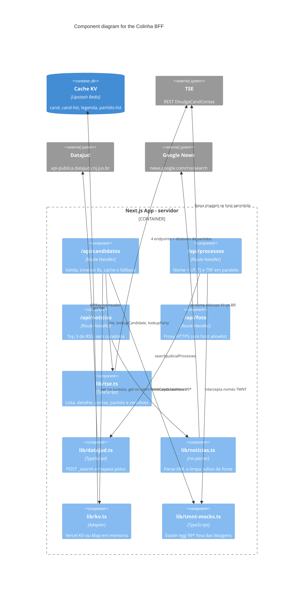

# Component Diagram — BFF e orquestração

Os route handlers são o único ponto que sai para a internet de dados. A chave
do Datajud e as URLs do TSE ficam no servidor.

## Chaves de cache

| Chave | Conteúdo |
|-------|----------|
| `cand:2026:{uf}:{tseCode}:{numero}` | Candidato completo |
| `cand-list:2026:{uf}:{tseCode}` | Lista do cargo |
| `legenda:2026:{uf}:{tseCode}:{partido}` | Voto de legenda |
| `partido-list:2026:{uf}:{tseCode}` | Partidos com candidato no cargo |

## Orquestração `lookupCandidate`

1. Lista do partido no cargo (`?partido=` + filtro local).
2. Em paralelo: detalhe do candidato, prestação de contas e gastos do
   diretório (`prestador/consulta/partido/...`).
3. Normaliza bens, despesas, limite, situação e PDFs de `arquivos` em
   certidões agrupadas por nome de arquivo.

Timeout ou corpo inválido do TSE vira erro; o route handler tenta o KV antes
de responder 500.

## Datajud

`tribunalsForUf(uf)` escolhe o TJ estadual e o TRF da região. Cada tribunal é
consultado em paralelo (`size: 50`, `match` em `partes.nome`). Tribunal fora
não derruba o outro: volta `disponivel: false`. Sem `DATAJUD_API_KEY`, a rota
responde 503.
