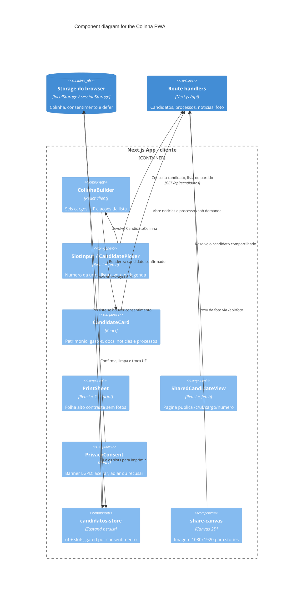

# Component Diagram — PWA no cliente

Tudo abaixo roda no browser. Páginas RSC só montam o casco; a colinha é
client-side porque depende de `localStorage` e de impressão.

## Páginas

| Rota | Componente | Render |
|------|------------|--------|
| `/` | `ColinhaBuilder` | Client. Fluxo principal |
| `/colinha` | `PrintSheet` | Client. `robots: noindex` |
| `/c/[uf]/[cargo]/[numero]` | `SharedCandidateView` | RSC de casco + fetch no cliente |
| `/privacidade`, `/termos` | páginas legais | Estáticas |

## Regras no cliente

- **Consentimento.** `hasValidLgpdConsent()` libera o storage do Zustand.
  Adiar usa `sessionStorage`; recusar apaga colinha e consentimento.
- **Voto de legenda.** Em cargos proporcionais, 2 dígitos confirmam o partido;
  completar o número troca para o candidato. Majoritários rejeitam `legenda`.
- **SWR.** Só `/api/noticias` usa SWR, e só com a seção aberta.
- **PWA.** `app/manifest.ts` (`standalone`). Não há service worker customizado
  além do que o Next/PWA do host oferecer.
