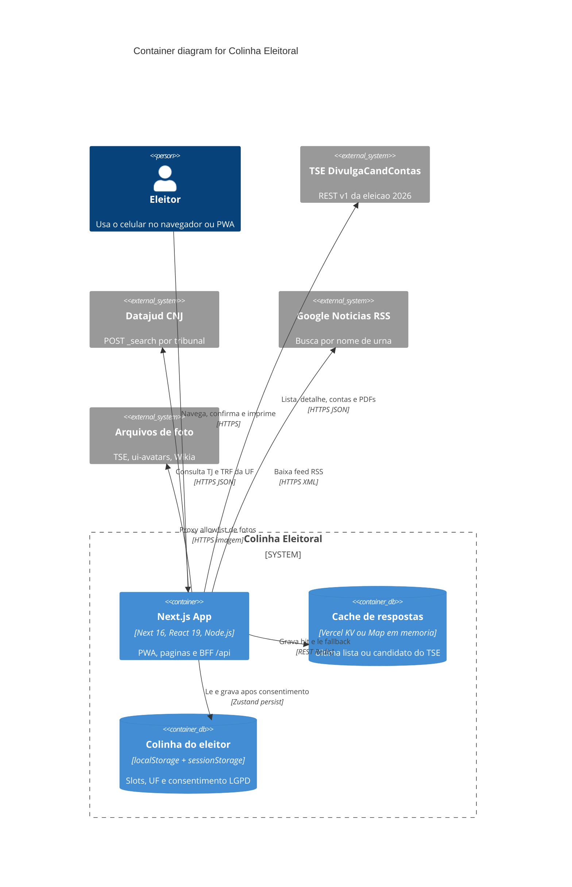

# Container Diagram — Colinha Eleitoral

Um único deploy Next.js (App Router) serve a PWA e o BFF. O cache de API e o
armazenamento do eleitor são containers separados porque vivem em processos
distintos.



## Containers

| Container | Tecnologia | Por que existe |
|-----------|------------|----------------|
| Next.js App | Next 16 App Router, runtime `nodejs`, região `gru1` | UI + BFF no mesmo artefato. Timeout de 8s nas rotas de dados |
| Cache de respostas | `@vercel/kv` se `KV_REST_API_*` existir; senão `Map` com TTL de 30 dias | Fallback quando o TSE falha. Header `X-Data-Source: kv-fallback` |
| Colinha do eleitor | Zustand persist + `localStorage` | Seis slots de cargo + UF. Sem consentimento LGPD, não persiste |

## Cache do TSE (duas camadas)

1. **Next.js Data Cache** no `fetch` de `lib/tse.ts`: listas e diretório de
   partidos revalidam em 3600s; detalhes, contas e gastos do partido em 900s.
2. **KV / memória** escrito após sucesso do BFF. Só é lido no `catch` (TSE
   fora, timeout, JSON inválido). Respostas ao browser vão com
   `Cache-Control: private, no-store`.

Notícias usam Data Cache de 1h e `max-age=300` no cliente. Processos e o mock
TMNT não passam pelo KV.

## Superfície do BFF

```text
GET /api/candidatos?uf=&cargo=&lista=true
GET /api/candidatos?uf=&cargo=&partidos=true
GET /api/candidatos?uf=&cargo=&numero=&legenda=true
GET /api/candidatos?uf=&cargo=&numero=
GET /api/processos?uf=&nome=
GET /api/noticias?nome=
GET /api/foto?src=
```
