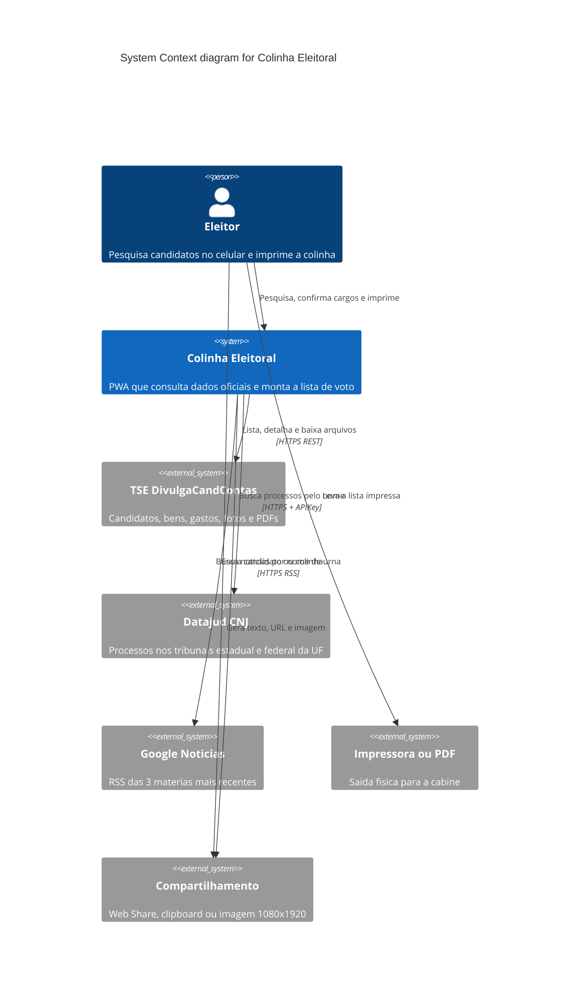

# System Context — Colinha Eleitoral

O eleitor usa um único sistema. Colinha agrega dados públicos, explica origem
e limites, e devolve uma lista imprimível. Nenhuma identidade é criada no
servidor.

## Atores

| Elemento | Tipo | Papel |
|----------|------|--------|
| Eleitor | Pessoa | Público-alvo: celular, pouco tempo, português claro |
| Colinha Eleitoral | Sistema | Único produto. Sem login. Sem banco de usuários |
| TSE DivulgaCandContas | Externo | Fonte oficial de candidatura e contas |
| Datajud / CNJ | Externo | Índice público de processos; não é certidão |
| Google Notícias | Externo | Busca automática, sem curadoria |
| Impressora / PDF | Externo | Folha alto contraste, sem fotos |
| Compartilhamento | Externo | Link `/c/{uf}/{cargo}/{numero}` ou imagem canvas |
