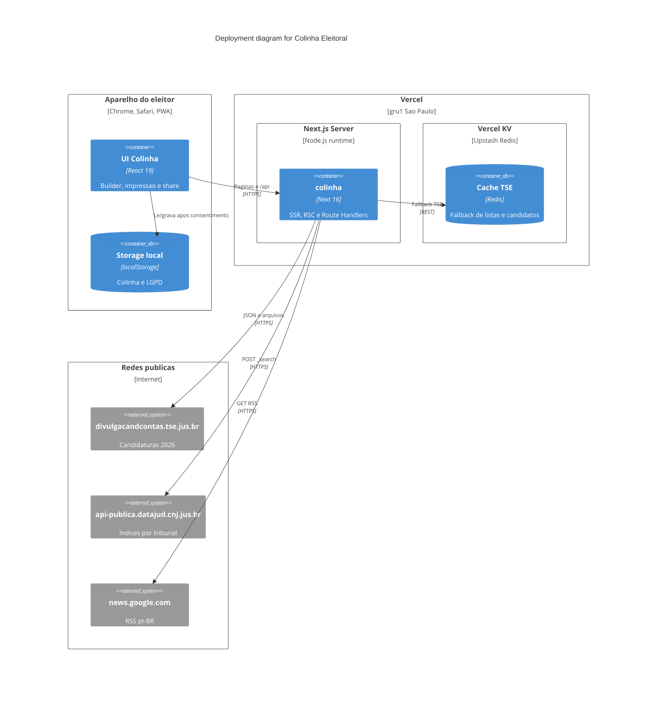

# Deployment Diagram — Colinha Eleitoral

Produção na Vercel, região `gru1` (São Paulo). O eleitor não autentica; o
estado da sessão vive no aparelho.

## Ambiente

| Variável | Obrigatória | Uso |
|----------|-------------|-----|
| `TSE_BASE_URL` | Não | Default: `https://divulgacandcontas.tse.jus.br/divulga/rest/v1` |
| `KV_REST_API_URL` / `KV_REST_API_TOKEN` | Não | Sem elas, cache em memória no processo |
| `DATAJUD_API_KEY` | Para processos | Só no servidor. Nunca no bundle |
| `NEXT_PUBLIC_PRIVACY_EMAIL` | Não | Canal LGPD na política de privacidade |
| `ADMIN_SYNC_SECRET` | Para `/admin/sync` | Senha do painel que grava o KV pelo celular |
| `TSE_LIVE` | Não | `1` força TSE ao vivo; `0` força só cache. Na Vercel o padrão é só cache |

`vercel.json` fixa `"regions": ["gru1"]`. As rotas de API repetem
`preferredRegion = "gru1"` e `runtime = "nodejs"`.

O Akamai do TSE bloqueia a região `gru1` (ASN AWS). Produção não consulta
a REST ao vivo. O cache chega por `npm run sync:tse` em rede de ISP ou pelo
modo ponte descrito em
[c4-dynamic-tse-ponte.md](./c4-dynamic-tse-ponte.md).

## Limites operacionais

- Timeout de 8 segundos em candidatos, processos e notícias.
- Foto: só hosts `divulgacandcontas.tse.jus.br`, `ui-avatars.com` e
  `static.wikia.nocookie.net`; cache público de 24h.
- Imagens remotas no `next/image` seguem o mesmo allowlist em `next.config.ts`.
- Dev local: `npm run dev`. KV ausente não quebra o app; Datajud ausente
  devolve 503 só na consulta judicial.
