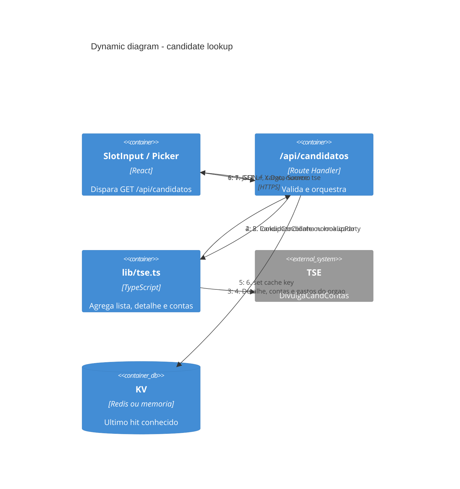
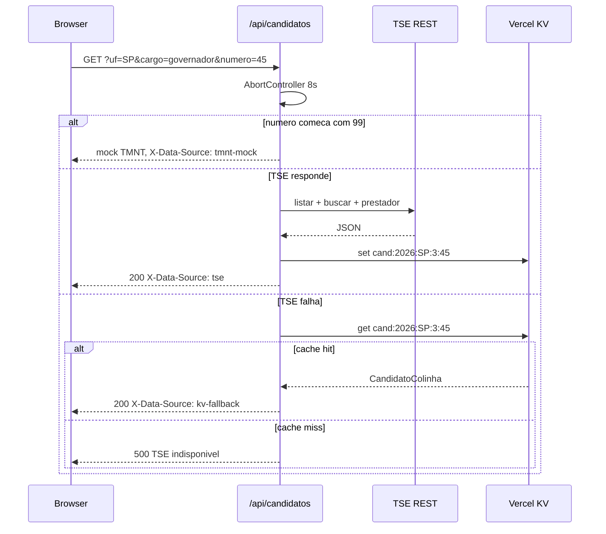

# Dynamic — consulta de candidato

Fluxo mais crítico: o eleitor informa UF, cargo e número (ou escolhe na
lista). Na Vercel o BFF lê o KV. No `dev` com `TSE_LIVE`, tenta o TSE ao
vivo e só cai no cache se essa chamada falhar.

Na Vercel o passo 3 em geral nem dispara: o BFF lê o KV que a ponte ou o
`sync:tse` gravaram. O diagrama abaixo ainda vale no `dev` local com
`TSE_LIVE=1`. Ver [c4-dynamic-tse-ponte.md](./c4-dynamic-tse-ponte.md).

## Fallback (TSE fora ou timeout)

## Modos da mesma rota

| Query | Função | Erros típicos |
|-------|--------|----------------|
| `lista=true` | Todos os candidatos do cargo na UF | 500 se TSE e KV falharem |
| `partidos=true` | Siglas com candidato no cargo proporcional | 400 se cargo majoritário |
| `numero` + `legenda=true` | Voto nos 2 dígitos do partido | 404 se o partido não lança ninguém |
| `numero` | Candidato completo | 404 se o número não existe |

Listagens **nunca** incluem o mock TMNT. O mock só entra em consulta pontual
de número ou de nome.
