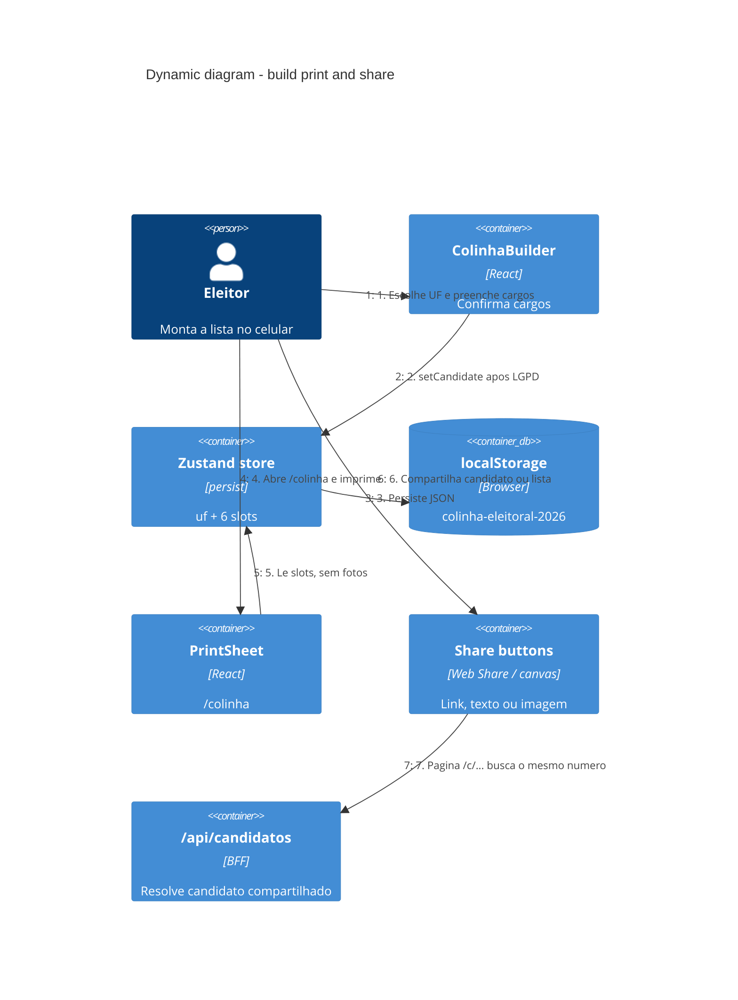
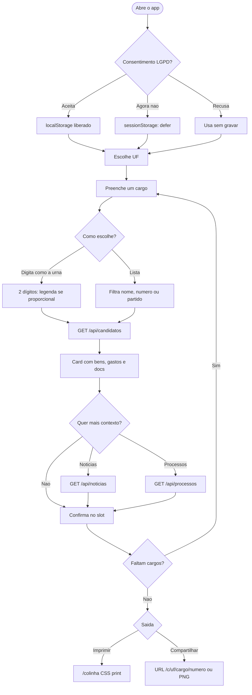

# Dynamic — montar, imprimir e compartilhar

A colinha é um documento local de seis slots. O servidor não a armazena.

## Jornada do eleitor

## O que a folha impressa omite de propósito

Fotos, notícias, processos e PDFs ficam fora da colinha. A folha traz cargo,
número, nome de urna ou `VOTO DE LEGENDA`, partido e UF — o que cabe na cabine.
