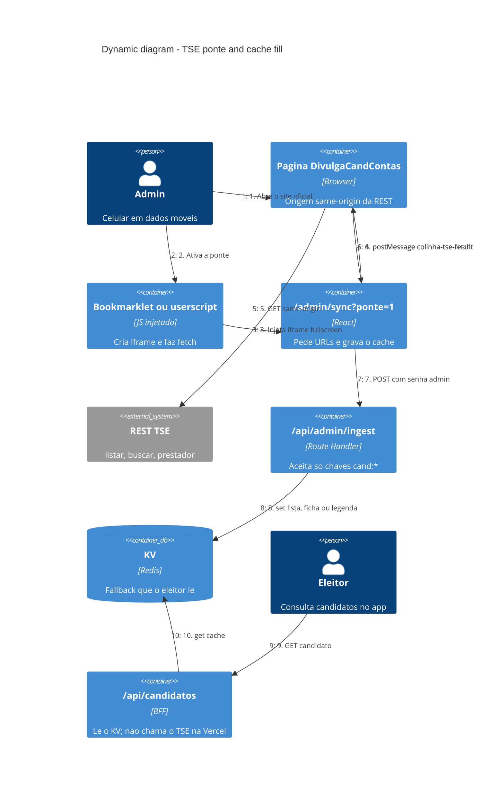
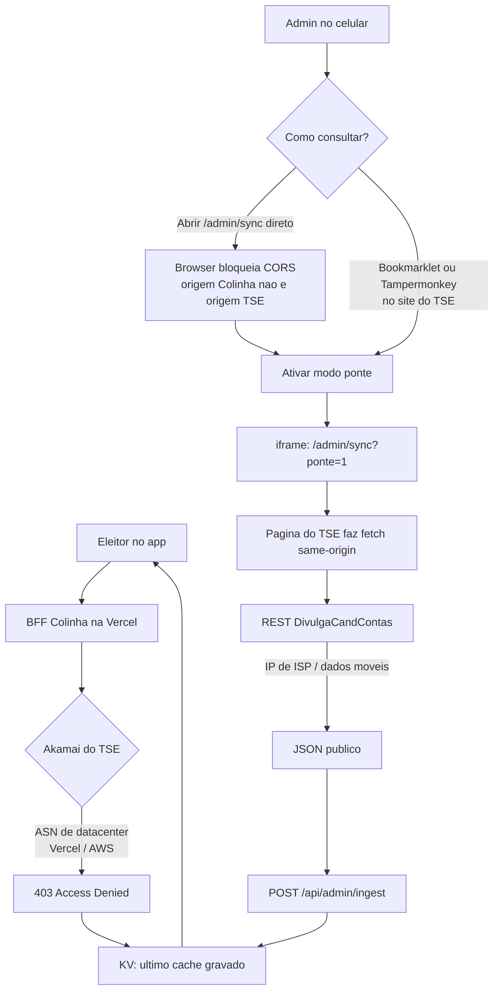
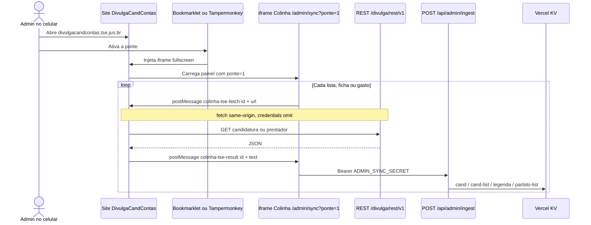
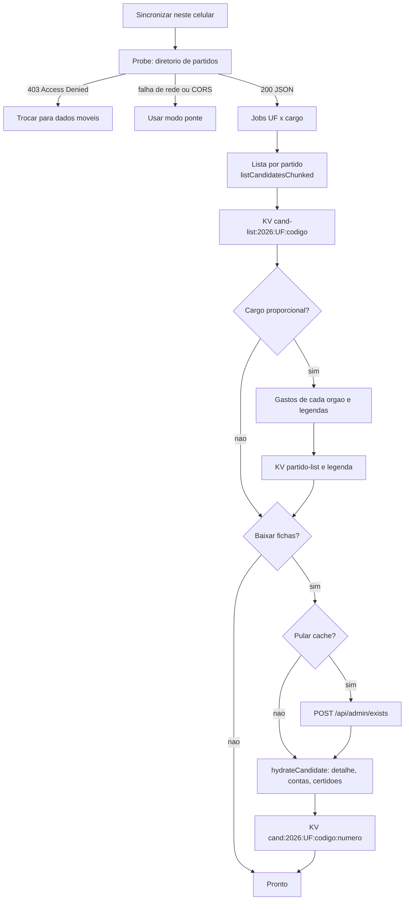

# Dynamic — cache do TSE e modo ponte

O eleitor lê candidatos pela Colinha. A Colinha, na Vercel, **não consegue**
falar com a API do TSE. Esta página explica as duas travas, por que cada
atalho ingênuo falha, e como o modo ponte popula o cache que o eleitor usa.

## O problema em uma frase

A API DivulgaCandContas é pública, mas o Akamai na frente dela trata a Vercel
como robô de datacenter e o navegador trata a Colinha como origem estranha.
Sem um cache preenchido **fora** da Vercel, o app não tem o que mostrar.

## As duas travas

Imagine a API do TSE como um balcão de atendimento público. Qualquer pessoa
pode ir até lá. O que muda é **quem** chega e **de onde**.

### Trava 1 — Akamai bloqueia ASN de datacenter

Quando o BFF na Vercel faz `fetch` no TSE, o pedido sai de um IP da AWS.
O Akamai do TSE responde `403 Access Denied`. Não é autenticação: não há
login. É um filtro de rede que assume “IP de nuvem = scraper”.

Por isso `isTseLiveEnabled()` desliga a consulta ao vivo em produção
(`VERCEL` definido). Tentar ao vivo só gasta o timeout de 8s. Quem popula o
KV é um processo em **IP de ISP**: Wi-Fi de casa, dados móveis, ou o painel
admin no celular.

Headers de `Origin`, `Referer` e `User-Agent` em `lib/tse-fetch.ts`
imitam o site oficial. Eles ajudam quando o IP já é de operadora. **Não
furam** o Akamai se o ASN for Vercel, AWS, GitHub Actions, VPN ou Zscaler.

### Trava 2 — o navegador aplica CORS

Abrir `/admin/sync` na origem da Colinha e chamar a REST do TSE é um pedido
**cross-origin**. O browser bloqueia a leitura da resposta, mesmo que o
Akamai tivesse deixado passar. A Colinha não controla os headers CORS do
TSE; não dá para “liberar” isso no nosso servidor.

## Por que a ponte existe

A REST do TSE **é same-origin** quando o `fetch` parte de
`https://divulgacandcontas.tse.jus.br`. O site oficial já faz exatamente
isso para montar as telas de candidatura.

A ponte aproveita essa regra do browser:

1. O admin abre o site do TSE (IP residencial / móvel → Akamai aceita).
2. Um script injetado nessa origem cria um iframe da Colinha
   (`/admin/sync?ponte=1`).
3. O painel não chama o TSE. Manda um `postMessage` pedindo a URL.
4. A página pai, que **é** o TSE, faz o `fetch` e devolve o JSON.
5. A Colinha grava no KV. O eleitor nunca passa por essa dança.

Não há sessão do TSE envolvida: o fetch usa `credentials: "omit"`. São os
mesmos JSON que o site oficial já publica.

## Sequência de um pedido

Contrato das mensagens:

| Direção | `type` | Conteúdo |
|---------|--------|----------|
| iframe → página TSE | `colinha-tse-fetch` | `id`, `url`, `method` |
| página TSE → iframe | `colinha-tse-result` | `id`, `ok`, `status`, `text` ou `error` |

Origens checadas dos dois lados: só `https://divulgacandcontas.tse.jus.br` e
a origem da Colinha. Timeout de 60s. Um `id` aleatório casa pedido e
resposta quando vários fetches estão no ar.

## O que o painel baixa

Com a ponte ligada, `tseFetch` vira `createPonteFetch()`. Sem ponte, o
painel tenta `fetch` direto e, se o CORS estourar, pede para ativar a ponte.

Depois disso o eleitor não usa a ponte. O BFF lê o KV. Ver
[c4-dynamic-candidate-lookup.md](./c4-dynamic-candidate-lookup.md).

## Decisões e porquês

Cada escolha abaixo existe porque a alternativa mais óbvia quebra numa das
duas travas, ou vira um risco operacional.

### Por que o BFF não chama o TSE na Vercel

O Akamai responde 403 para ASN de nuvem. Insistir no `fetch` ao vivo só
atrasa a tela do eleitor até o timeout. Em produção o padrão é **só cache**
(`TSE_LIVE` implícito `false` quando `VERCEL` existe). `TSE_LIVE=1` existe
para o `dev` local em rede de ISP.

### Por que não basta imitar o browser do TSE

`lib/tse-fetch.ts` manda `Origin`, `Referer` e `User-Agent` iguais aos do
site. Isso é o mínimo para parecer o cliente oficial **quando o IP já é
aceitável**. O filtro do Akamai olha o ASN primeiro. Headers não mudam o
ASN da Vercel.

### Por que o eleitor não fala com o TSE

O browser do eleitor está na origem da Colinha. CORS bloquearia. Além disso
não queremos milhares de aparelhos batendo na REST do TSE. O BFF agrega,
normaliza e serve o cache. Ver a decisão “BFF no próprio Next.js” em
[README.md](./README.md).

### Por que popular o KV num celular, e não no GitHub Actions

O script `npm run sync:tse` faz o mesmo trabalho, mas também precisa de IP
de ISP. GitHub Actions é datacenter: o Akamai bloqueia igual. O painel
`/admin/sync` existe para quem está no 4G, sem notebook na rede de casa.

### Por que iframe + `postMessage`, e não um proxy nosso

Um proxy na Vercel reintroduz a trava 1: o IP continua sendo da AWS. A
ponte não é um proxy. É o **próprio browser do admin**, já aceito pelo
Akamai, fazendo o pedido na origem que a API espera. `postMessage` é a
ponte segura entre duas origens que o browser isolou de propósito.

### Por que `credentials: "omit"`

O fetch no TSE não precisa de cookie. Mandar credenciais misturaria a
sessão do admin no site oficial com um scraper. Omitir cookies deixa claro:
só JSON público, o mesmo que qualquer visitante já vê.

### Por que checar `event.origin` dos dois lados

Sem isso, qualquer aba poderia pedir URLs ou injetar JSON falso. O script
só aceita mensagens da origem da Colinha. O iframe só aceita respostas da
origem do TSE. O `id` impede que a resposta do pedido A feche o pedido B.

### Por que bookmarklet **e** userscript

São o mesmo injector (`ponteInjectorSource`). Mudam só a forma de ligar:

| Caminho | Quando usar | Por quê |
|---------|-------------|---------|
| Bookmarklet `/admin/ponte` | Firefox no tablet, Safari no iPhone | Favorito `javascript:` executa na página do TSE |
| Userscript `/admin/ponte.user.js` | Kiwi + Tampermonkey | Liga sozinho no `@match` do TSE |
| Chrome Android | Não serve | O Chrome no Android **não executa** atalho `javascript:` |

A página `/admin/ponte` existe por causa dessa última linha: no Chrome o
botão “parece” um link e não faz nada. Melhor explicar e mandar para
Firefox ou Kiwi do que fingir que funciona.

### Por que a lista vai partido a partido

`listCandidatesChunked` pede `?partido=` em vez da lista inteira do cargo.
A lista completa é um JSON enorme; no celular, pela ponte, um único GET
grande cai por timeout ou memória. Partir por partido, com pausa
configurável (padrão 250ms), reduz o tamanho de cada resposta e evita
parecer um flood. O delay é cortesia com o TSE, não um truque de bypass.

### Por que pular fichas que já estão no cache

Hidratatar cada candidato são vários GETs (detalhe, contas, gastos do
órgão). `/api/admin/exists` pergunta ao KV o que já existe. Recomeçar uma
sync interrompida no 4G não deve baixar de novo o que já gravou.

### Por que o ingest exige senha e só aceita chaves `cand:*`

Qualquer um que abra `/admin/sync` não pode escrever no Redis. O Bearer
`ADMIN_SYNC_SECRET` autentica. `isTseCacheKey` impede gravar chaves
arbitrárias. Lotes de no máximo 40 itens evitam um POST gigante no 4G.

O ingest é chamado **pelo iframe** (origem Colinha), então o CORS extra
permitindo a origem do TSE é só uma folga: o fluxo atual não precisa que a
página pai grave no KV.

### Por que o probe testa o diretório de partidos primeiro

É um GET pequeno e estável. Se vier `Access Denied`, o IP ainda está
marcado (Wi-Fi corporativo, VPN). Se o `fetch` estourar, é CORS: falta a
ponte. Falhar cedo evita meia hora de sync inútil.

## Arquivos

| Papel | Onde |
|-------|------|
| Detector de “estamos num iframe” e `createPonteFetch` | `lib/tse-ponte.ts` |
| Bookmarklet / userscript | `lib/tse-ponte-script.ts` |
| Página de instalação no tablet | `app/admin/ponte/route.ts` |
| Painel que orquestra a sync | `components/admin-sync-panel.tsx` |
| Grava e consulta o KV | `app/api/admin/ingest/route.ts`, `exists/route.ts` |
| Headers do cliente “oficial” | `lib/tse-fetch.ts` |
| Liga/desliga TSE ao vivo | `lib/tse-live.ts` |
| Sync pelo notebook em ISP | `scripts/sync-tse.ts` |
